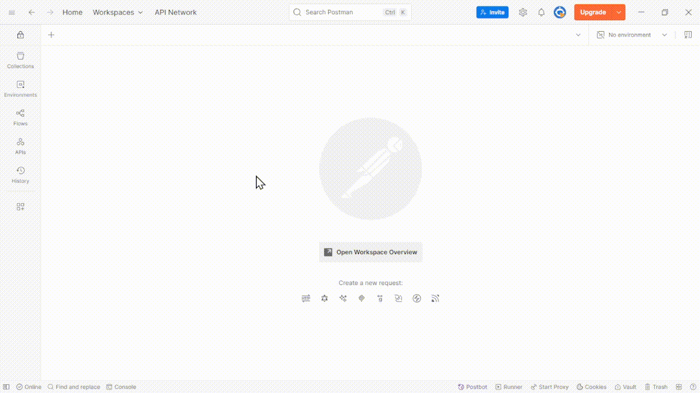

# 📝 Blog API with Flask & MySQL

A RESTful API for managing blog posts — built with **Flask**, **MySQL**, and **MySQL Workbench**.

---



## 📦 Features

- ✅ Create blog posts
- ✅ Read single and all posts
- ✅ Update existing posts
- ✅ Delete blog posts
- ✅ Search posts by keyword (title, content, or category)
- 🔒 Secure credentials via `.env` file
- 🧠 JSON tag support with MySQL

---

## ⚙️ Tech Stack

- **Backend:** Python (Flask)
- **Database:** MySQL (accessed via MySQL Workbench)
- **ORM:** `flask-mysqldb` (using raw SQL)
- **Environment Management:** `python-dotenv`
- **Cross-Origin Support:** `flask-cors`

---

## 📁 Folder Structure

```

blog-api/  
├── app.py             # Main Flask application  
├── .env               # Environment variables (DO NOT COMMIT)  
├── .gitignore         # Git ignore list  
├── requirements.txt   # Python dependencies  
└── README.md          # Setup and usage guide

````

---

## 🚀 Getting Started

### ✅ Prerequisites

Make sure these are installed:

- [Python 3.7+](https://www.python.org/downloads/)
- [MySQL Workbench](https://dev.mysql.com/downloads/workbench/)
- [Git](https://git-scm.com/)
- MySQL Server (usually comes with Workbench)

---

## 🔐 Step 1: Create `.env` File

Create a file named `.env` in your root directory with:

```env
MYSQL_HOST=localhost
MYSQL_USER=root
MYSQL_PASSWORD=yourpassword
MYSQL_DB=blogdb
MYSQL_PORT=3306         # Default port is '3306'. You can change to preferred PORT.
````

> Replace `yourpassword` with your actual MySQL root password.

---

## 🧱 Step 2: Set Up the Database in MySQL Workbench

1. Open **MySQL Workbench**
2. Connect to your local MySQL server
3. Run the following SQL script:

```sql
CREATE DATABASE IF NOT EXISTS blogdb;

USE blogdb;

CREATE TABLE IF NOT EXISTS posts (
    id INT AUTO_INCREMENT PRIMARY KEY,
    title VARCHAR(255),
    content TEXT,
    category VARCHAR(100),
    tags TEXT,
    created_at DATETIME,
    updated_at DATETIME
);
```

---

## 📦 Step 3: Install Dependencies

### (Optional) Create and activate virtual environment:

```bash
python -m venv venv
venv\Scripts\activate  # Windows
# OR
source venv/bin/activate  # macOS/Linux
```

### Install required packages:

```bash
pip install -r requirements.txt
```

If `requirements.txt` is missing, create it manually:

```bash
pip install flask flask-mysqldb flask-cors python-dotenv
pip freeze > requirements.txt
```

---

## ▶️ Step 4: Run the Application

```bash
python app.py
```

Expected output:

```
* Running on http://127.0.0.1:5000/
```

---

## 📬 API Endpoints

### ➕ Create a Blog Post

```http
POST /posts
Content-Type: application/json
```

```json
{
  "title": "My First Blog Post",
  "content": "Hello world!",
  "category": "Technology",
  "tags": ["Flask", "MySQL"]
}
```

---

### 🔁 Update a Blog Post

```http
PUT /posts/<id>
```

```json
{
  "title": "Updated Title",
  "content": "Updated content",
  "category": "Dev",
  "tags": ["Python", "API"]
}
```

---

### ❌ Delete a Blog Post

```http
DELETE /posts/<id>
```

---

### 📄 Get a Single Blog Post

```http
GET /posts/<id>
```

---

### 📚 Get All Blog Posts

```http
GET /posts
```

---

### 🔍 Search Blog Posts

```http
GET /posts?term=python
```

Returns posts where `term` matches `title`, `content`, or `category`.

---

## 🧪 Testing the API

Use one of the following tools to test your endpoints:

- 🧪 [Postman](https://www.postman.com/)
- 🧪 [Thunder Client (VS Code)](https://www.thunderclient.com/)
- 🧪 `curl` in the terminal

### Example `curl` test:

```bash
curl -X POST http://127.0.0.1:5000/posts \
  -H "Content-Type: application/json" \
  -d '{"title": "Hello", "content": "World", "category": "General", "tags": ["Intro"]}'
```

---

## 🔒 Security Notes

- NEVER commit `.env` to GitHub.
- Always add it to `.gitignore`:

```bash
echo ".env" >> .gitignore
```

---

## 🧾 License

MIT License

---
